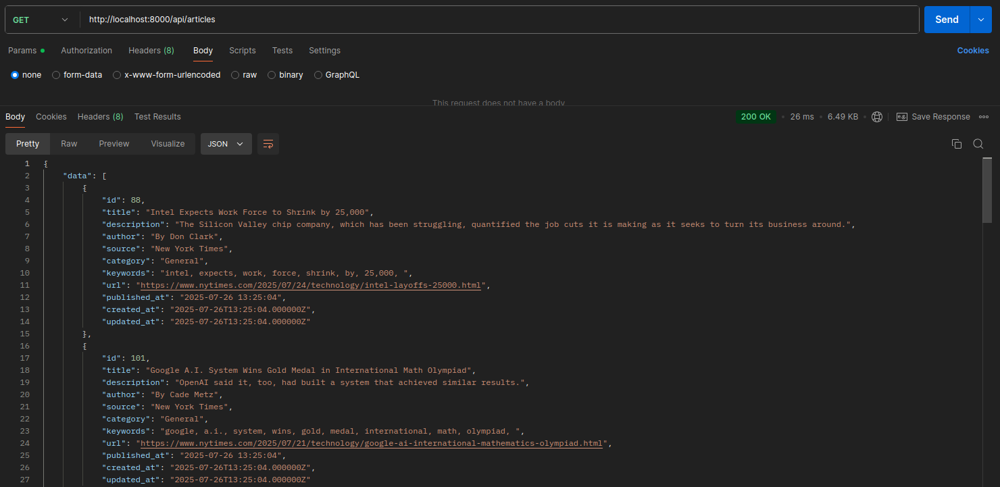
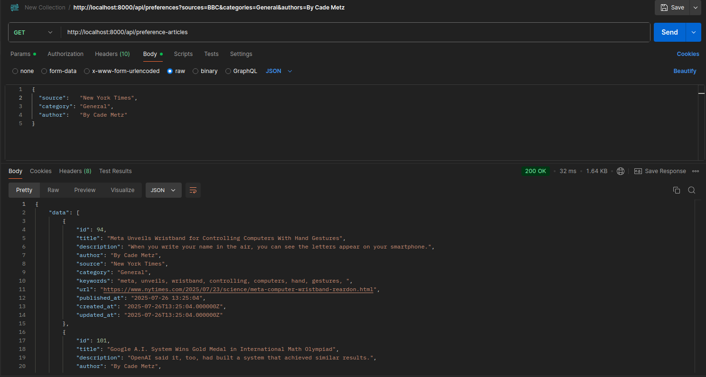
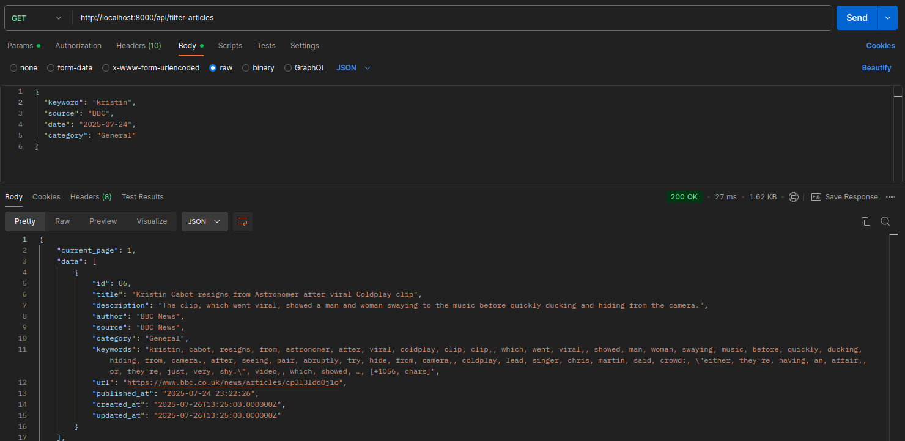

## News Aggregator API Documentation

## Overview

The **News Aggregator** project is a system designed to fetch, store, and manage news articles from three major APIs: **New York Times**, **BBC News**, and **NewsAPI**. Articles are collected daily using a scheduled task, and users can manually fetch them as needed. The system provides various API endpoints to handle article management.
However, the BBC documentation was too bad, so alternatively we get the bbc news from the newsapi.org with the bbc-news source. Please check the code for more details OR fetch the articles and review the articles table source column.

---

### Prerequisites
#### 1. PHP >= 8.3
#### 2. Composer
#### 3. Mysql
#### 4. PHP Extensions: `mysqli`, `pdo_mysql`, `pdo_sqlite`
#### 5. Postman for API testing

---

## Installation Guide

### 1. **Cloning the Repository**
1. Open a terminal window.
2. Change the current working directory to the location where you want the cloned directory.
3. Run the following command to clone the repository:

   ```bash
   git clone git@github.com:Hasnain74/news-aggregator-api.git
   cd news-aggregator-api
   ```
---
## Composer
First install the composer dependencies:
`composer install`

---

## Environment Setup

```bash 
cp .env.example .env
php artisan key:generate
```
Edit the `.env` file to configure your database connection and other settings.

---

## Database Migrations
`php artisan migrate`

---

## Start the Development Server
`php artisan serve`

The application will be available at `http://127.0.0.1:8000`

---

## Unit tests
`php artisan test`

Make sure `pdo_sqlite` extension is active in .ini file

---

## Base URL
`http://127.0.0.1:8000/api`

---

## API Endpoints
### 1. View All Articles
#### Endpoint: `GET /articles`
#### Headers: `Accept: application/json`


### 2. View Articles by Preference
#### Endpoint: `GET /preference-articles`
#### Headers: `Accept: application/json` `Content-Type: application/json`
#### Body (JSON): 
```bash
{
  "source":   "New York Times",
  "category": "General",
  "author":   "By Cade Metz"
}
```


### 3. Filter Articles
#### Endpoint: `GET /filter-articles`
#### Headers: `Accept: application/json` `Content-Type: application/json`
#### Body (JSON):
```bash
{
  "keyword":   "kristin",
  "source": "BBC",
  "date": "2025-07-24", (You can pick the existing date from DB)
  "category": "General"
}
```
You can send all of params at once OR one by one for filtering.




---

## Features

1. **Daily News Fetching**  
   Articles are automatically fetched from external APIs daily using a scheduler.

    - To run the scheduler manually:

      `php artisan fetch:articles`

2. **Article Preferences and Filtering**  
   Users can view articles tailored to their preferences or filter articles by specific keywords.

---
## Scheduler Details

- **Daily Article Fetching:**  
  A Laravel scheduler fetches articles daily. If needed, run the following command manually to fetch articles:

  `php artisan fetch:articles`
